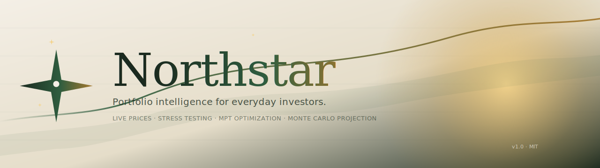
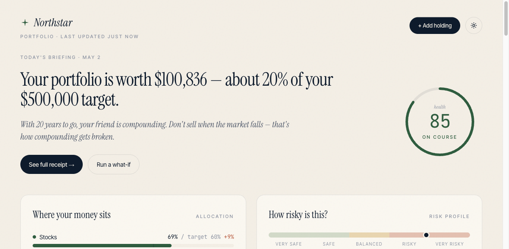
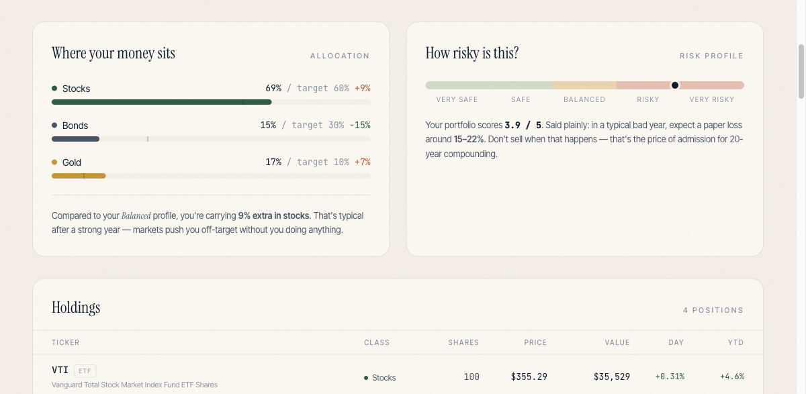
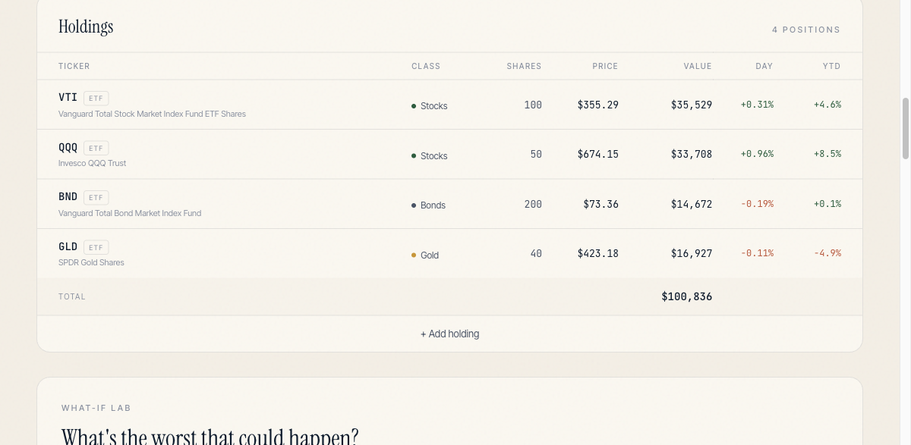
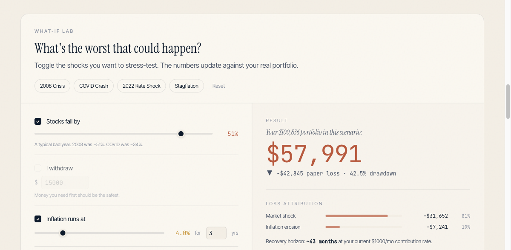
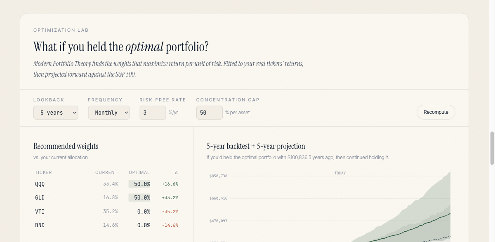
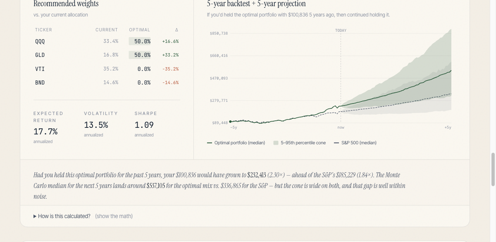
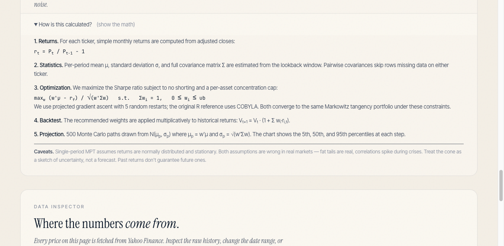
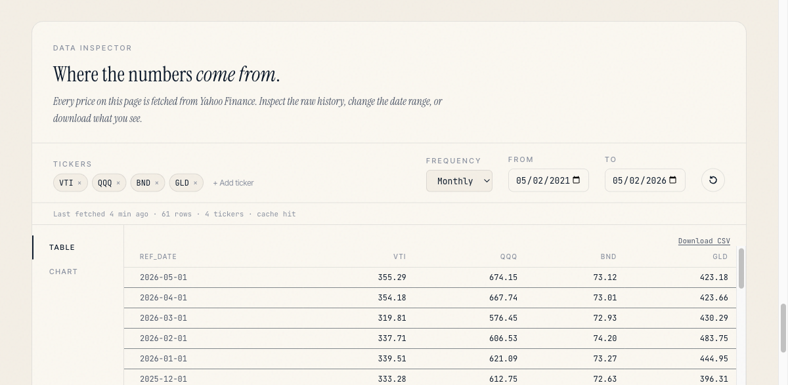

<div align="center">



<br/>

**Portfolio intelligence for everyday investors.**

See where your money sits, what could go wrong, and exactly what to do about it.

<p>
  <a href="https://northstar-portfolio.vercel.app">
    
  </a>
  <a href="https://nextjs.org">
    
  </a>
  <a href="https://www.typescriptlang.org">
    
  </a>
  <a href="https://tailwindcss.com">
    
  </a>
  
</p>

</div>

---

## ✦ A first look

<div align="center">
  
  <p><sub><i>Live prices, a goal-aware headline, and a one-glance health score — fetched from Yahoo Finance with no broker login.</i></sub></p>
</div>

---

## What it does

Northstar is a browser-only portfolio tracker that fetches live prices from Yahoo Finance and puts the math in plain sight. No accounts, no broker OAuth, no black boxes — just your tickers, your shares, and honest numbers.

| | |
|---|---|
| 🟢 **Live prices** | Quotes polled every 60 seconds via Yahoo Finance |
| 🌪 **Stress testing** | Model 2008, COVID, rate shocks, and stagflation against your real portfolio |
| 🧮 **Optimization Lab** | MPT-optimal weights for your tickers, backtested + Monte Carlo projected vs. the S&P 500 |
| 🧭 **Allocation health** | Drift from your target by asset class, updated in real time |
| 🎯 **Goal wizard** | Set a target amount and horizon — hero copy and risk advice adapt instantly |
| 🧾 **Transparency receipts** | Every rebalance trade shown with real commission, SEC fee, and slippage |
| 🔬 **Data Inspector** | Raw Yahoo history as a table or indexed chart, downloadable as CSV |
| 📦 **No backend** | Everything persists in `localStorage` — works offline after first load |

---

## ✦ Walk-through

<table>
  <tr>
    <td width="50%" valign="top">
      <a href="docs/screenshots/02-allocation-risk.png">
        
      </a>
      <p><b>Allocation health & risk profile.</b><br/>
      <sub>Drift from your goal-implied target, side-by-side with a 0–5 risk score. The risk text adapts to your horizon — short, blunt, no jargon.</sub></p>
    </td>
    <td width="50%" valign="top">
      <a href="docs/screenshots/03-holdings.png">
        
      </a>
      <p><b>Holdings table.</b><br/>
      <sub>Live price, value, day change, YTD per row — auto-classified by asset class. Add holdings one at a time or paste <code>VTI 45</code> from your broker.</sub></p>
    </td>
  </tr>
  <tr>
    <td width="50%" valign="top">
      <a href="docs/screenshots/04-stress-test.png">
        
      </a>
      <p><b>What-if stress lab.</b><br/>
      <sub>Toggle 2008, COVID, rate shock, stagflation — or hand-tune the sliders. The result panel shows your dollar loss, drawdown, loss attribution by driver, and a recovery horizon estimate.</sub></p>
    </td>
    <td width="50%" valign="top">
      <a href="docs/screenshots/05-projection-lab.png">
        
      </a>
      <p><b>Optimization Lab — MPT.</b><br/>
      <sub>Modern Portfolio Theory finds the Sharpe-maximizing weights for <i>your</i> tickers. Adjustable lookback, frequency, risk-free rate, and concentration cap.</sub></p>
    </td>
  </tr>
  <tr>
    <td width="50%" valign="top">
      <a href="docs/screenshots/06-projection-chart.png">
        
      </a>
      <p><b>Backtest + Monte Carlo projection.</b><br/>
      <sub>5 years of backtest, 5 years of forward Monte Carlo (5–95th percentile cone), benchmarked against the S&P 500. Annualized stats: expected return, volatility, Sharpe.</sub></p>
    </td>
    <td width="50%" valign="top">
      <a href="docs/screenshots/07-show-the-math.png">
        
      </a>
      <p><b>Show the math.</b><br/>
      <sub>Every step disclosed in plain English with the formulas. Plus honest caveats — fat tails are real, correlations spike during crises, MPT is a sketch, not a forecast.</sub></p>
    </td>
  </tr>
  <tr>
    <td width="50%" valign="top">
      <a href="docs/screenshots/08-data-inspector.png">
        
      </a>
      <p><b>Data Inspector.</b><br/>
      <sub>Inspect every number behind the dashboard. Raw Yahoo prices in a table or chart, any frequency, any range — downloadable as CSV.</sub></p>
    </td>
    <td width="50%" valign="top">
      <br/>
      <blockquote>
        <h3>Why no backend?</h3>
        <p>A portfolio tracker that asks for your <em>broker login</em> is a security tax for a feature you can do better client-side. Northstar reads <strong>only public market data</strong>. Your holdings live in <code>localStorage</code> on your machine — nothing leaves the browser, nothing is logged, nothing breaks if the server goes down.</p>
        <p><sub>Built for clarity, not data hoarding.</sub></p>
      </blockquote>
    </td>
  </tr>
</table>

---

## Features in depth

### Portfolio dashboard
Add holdings one at a time or paste a list (`VTI 45`) — prices and asset classification resolve automatically. The dashboard shows total value, day change, YTD, allocation drift, and a 0–5 risk score with a plain-English summary.

### What-if stress lab
Toggle any combination of market shocks:
- **2008 Financial Crisis** — 51% equity drawdown
- **COVID Crash** — 34% rapid drop
- **2022 Rate Shock** — bond + equity repricing
- **Stagflation** — inflation erosion over multiple years

The result panel shows your portfolio's dollar loss, drawdown percentage, loss attribution by driver, and estimated recovery horizon based on your contribution rate.

### Optimization Lab — MPT + Monte Carlo
Modern Portfolio Theory applied to *your* tickers, *your* data. Northstar pulls 5 years of monthly returns from Yahoo, computes the full covariance matrix, and finds the weights that maximize the Sharpe ratio subject to no shorting and a per-asset concentration cap.

- **Optimizer** — projected gradient ascent with 5 random restarts, simplex projection via Lagrange-multiplier bisection. Converges to within 1e-5 of COBYLA on test portfolios.
- **Backtest** — applies the recommended weights to historical returns and walks $V_t$ forward. Compared side-by-side against SPY.
- **Monte Carlo projection** — 500 normal-draw paths from $\mathcal{N}(\mu_p, \sigma_p)$ where $\mu_p = w'\mu$ and $\sigma_p = \sqrt{w'\Sigma w}$. Chart shows the 5th / 50th / 95th percentile cone forward.
- **Show the math** — every step (returns, statistics, optimization, backtest, projection) is disclosed in plain English with the formulas, plus honest caveats about MPT's normality assumption.

Adjustable: lookback (3 / 5 / 10 yr), frequency (weekly / monthly), risk-free rate, concentration cap.

### Scenario-aware rebalance receipts
"See how to protect" generates a trade list biased for the active scenario — more bonds for a market shock, more gold for inflation, higher cash for a withdrawal event. Each trade includes:
- Commission (free at most US brokers)
- SEC + TAF fees at the real rate
- Slippage at 3 basis points
- LTCG tax estimate

### Goal wizard
Name your goal, set a target amount, and pick a horizon. Northstar infers the right risk profile (Cautious ≤ 4 yr, Balanced ≤ 10 yr, Growth 10 yr+) and recalculates target allocations and stress-test severity accordingly.

### Data Inspector
Inspect the raw price history behind every number. Change the frequency (daily / weekly / monthly / yearly), adjust the date range, and switch between a scrollable table and an indexed line chart. Download any view as CSV.

---

## Tech stack

| Layer | Choice |
|---|---|
| Framework | Next.js 14 (App Router) |
| Language | TypeScript 5 |
| Styling | Tailwind CSS 3 |
| Animations | Framer Motion |
| Charts | Recharts + custom SVG |
| Icons | Lucide React |
| Market data | yahoo-finance2 (server-side, 5-min TTL cache) |
| Persistence | `localStorage` — key `northstar.portfolio.v1` |
| Fonts | Instrument Serif · Inter Tight · JetBrains Mono |

---

## Getting started

```bash
# Clone
git clone https://github.com/as567-code/northstar.git
cd northstar

# Install
npm install

# Run
npm run dev        # → http://localhost:3000
```

No environment variables required — the Yahoo Finance API calls are made server-side with no key needed.

### Build for production

```bash
npm run build
npm run start
```

---

## Project structure

```
app/
├── page.tsx              # Root redirect → /dashboard
├── dashboard/page.tsx    # Main dashboard (single page)
├── api/quote/route.ts    # Live price endpoint (polled every 60s)
└── api/tickers/route.ts  # Historical data endpoint (5-min TTL)

lib/
├── types.ts              # All shared types — single source of truth
├── portfolio-store.ts    # usePortfolio() — localStorage state hook
├── use-quotes.ts         # useQuotes() — live price polling hook
├── data-download.ts      # dataDownload() — historical data fetcher
├── sim.ts                # Shock primitives + runScenario()
├── optimizer.ts          # MPT math: returns, Sharpe maximizer, backtest, Monte Carlo
└── ticker-classifier.ts  # Asset class inference from Yahoo metadata

components/
├── Hero.tsx              # Portfolio value + goal-aware headline
├── Header.tsx            # Nav + settings menu
├── AllocationCard.tsx    # Drift visualization by asset class
├── RiskRibbon.tsx        # 0–5 risk score bar
├── HoldingsTable.tsx     # Live positions table
├── StressTest.tsx        # What-if lab with sliders + presets
├── ReceiptDrawer.tsx     # Trade receipt slide-in panel
├── GoalEditor.tsx        # Goal wizard modal
├── DataInspector.tsx     # Raw data table + chart + CSV
├── ProjectionLab.tsx     # MPT optimizer UI + backtest/projection chart
├── EmptyState.tsx        # Welcome screen with entry form
└── AddHoldingModal.tsx   # Paste-list flow
```

---

## Architecture notes

- **State** — `usePortfolio()` is the single source of truth. All components read from and write to this hook; nothing goes through props drilling or a separate context.
- **Live prices** — `useQuotes(symbols)` calls `/api/quote` in a 60-second polling loop. The API proxies Yahoo Finance and returns price, day change %, and YTD change % for each symbol.
- **Historical data** — `dataDownload({ tickers, freq, from, to })` calls `/api/tickers`, which caches responses for 5 minutes and drops tickers whose data fails a quality threshold.
- **Simulation math** — `lib/sim.ts` exports five independent shock functions (`equityShock`, `inflationShock`, `rateShock`, `withdrawalShock`, `jobLossShock`) and `runScenario()`, which composes them and runs leave-one-out attribution.
- **Optimizer math** — `lib/optimizer.ts` builds the covariance matrix from simple returns, then maximizes the Sharpe ratio with projected gradient ascent under sum-to-one + box constraints. `monteCarloProjection()` draws 500 normal paths and returns percentile bands. SPY is fetched alongside the user's tickers as the benchmark.
- **Tax math** — LTCG rate by risk profile × ~10% gains fraction. SEC Section 31 fee at the real rate. Slippage at 3 bps on notional.

---

## License

MIT — do whatever you want with it.

---

<div align="center">
  <sub>Built for clarity, not complexity. Live prices via Yahoo Finance.</sub>
  <br/><br/>
  <a href="https://northstar-portfolio.vercel.app">
    
  </a>
</div>
